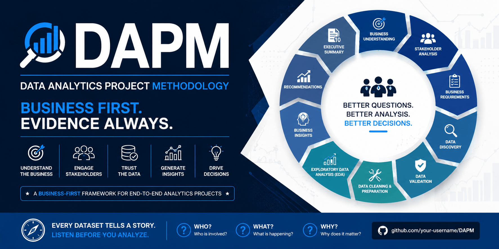

# DAPM Framework
**Data Analytics Project Methodology**
> **Business First. Evidence Always.**

<p align="center">
  
</p>

| Property | Value |
|----------|-------|
| **Current Version** | v0.1.0 |
| **Release Status** | Experimental |
| **Evidence Level** | Under Validation |
| **License** | MIT |
| **Framework Type** | Business-First Data Analytics Methodology |
| **Owned By** | Subir Sutradhar |
| **Maintained By** | Subir Sutradhar |


The **Data Analytics Project Methodology (DAPM)** is an open-source framework that provides a structured, repeatable, and business-first approach to executing end-to-end data analytics projects.

DAPM was created to help analysts solve business problems systematically instead of jumping directly into tools, dashboards, or code. It emphasizes understanding the business, identifying stakeholder needs, validating data, generating evidence-based insights, and delivering practical recommendations that support business decision-making.

The methodology is tool-independent and can be applied regardless of whether the project uses spreadsheets, SQL, Python, R, Power BI, Tableau, or other analytical technologies.

---

## Why DAPM?

Many analytics projects begin with a dataset.

The analyst loads the data, creates charts, builds dashboards, and presents the results.

While technically correct, this approach often overlooks the most important question:

> **What business problem are we trying to solve?**

DAPM takes a different approach.

Before exploring the data, the methodology focuses on understanding the business, identifying stakeholders, defining business requirements, and validating the available data.

Only then does analysis begin.

This ensures that every chart, insight, and recommendation contributes toward solving a real business problem rather than simply describing the data.

---

## Philosophy

DAPM is built on a simple belief:

> **Data informs decisions. Decisions create business value.**

Data helps organizations understand what has happened.

Analysis explains why it happened.

Insights reveal what it means.

Recommendations guide what should happen next.

Business value is created only when evidence leads to better decisions.

---

## The DAPM Mindset
>
> Every dataset tells a story.
>
> Listen before you analyze.
>
> Ask:
>
> **Who?**
>
> **What?**
>
> **Why?**
>
> Keep what answers the business question.
>
> Ignore what doesn't. Don't Garbage

## When to Use DAPM

DAPM is designed for projects where the goal is to solve a business problem through data analysis.

It is suitable for:

* Business analytics projects
* Exploratory data analysis (EDA)
* Dashboard development
* KPI and performance reporting
* Operational analytics
* Decision-support systems
* Portfolio projects
* Freelance analytics consulting
* Academic case studies

The methodology is domain-independent and can be applied across industries such as retail, healthcare, finance, manufacturing, logistics, education, and human resources.

---

## When DAPM May Not Be the Right Choice

DAPM is not intended to replace specialized methodologies used in software engineering, data engineering, machine learning, or scientific research.

Examples include:

* Software development projects
* ETL pipeline engineering
* Machine learning model development
* Deep learning research
* DevOps and infrastructure projects
* Scientific experiments requiring research methodologies

DAPM can complement these disciplines by providing a structured business analysis process before technical implementation, but it is not a substitute for their specialized workflows.


## Who Is DAPM For?

DAPM is designed for anyone who wants a structured approach to data analytics, including:

- Students learning data analytics
- Aspiring Data Analysts
- Business Analysts
- Freelance Analysts
- Data Analytics Consultants
- Analytics Teams
- Organizations seeking standardized analytics workflows

Whether you are analyzing a small spreadsheet or an enterprise database, the underlying analytical process remains the same.

---

## Objectives

DAPM aims to:

- Promote business-first thinking.
- Standardize the analytics workflow.
- Encourage evidence-based decision-making.
- Improve project documentation.
- Create repeatable analytical processes.
- Produce professional, portfolio-quality projects.
- Bridge the gap between technical analysis and business value.

---

## Core Principles

Every DAPM project follows these guiding principles.

- Business before technology.
- Stakeholders before dashboards.
- Data must be validated before analysis.
- Observations must be supported by evidence.
- Business insights must be traceable to observations.
- Recommendations must be practical and evidence-based.
- Documentation evolves throughout the project lifecycle.
- Every project should improve the methodology.

---

## What Makes DAPM Different?

DAPM focuses on **how analysts think**, not **which tools they use**.

Instead of prescribing programming languages or software, DAPM provides a structured methodology that guides analysts from the initial business problem to final business recommendations.

The framework encourages analysts to ask the right questions before searching for answers, helping ensure that technical work remains aligned with business objectives.

---

## DAPM Workflow

```text
Business Problem
        │
        ▼
Business Understanding
        │
        ▼
Stakeholder Analysis
        │
        ▼
Business Requirements
        │
        ▼
Data Discovery
        │
        ▼
Data Validation
        │
        ▼
Data Cleaning & Preparation
        │
        ▼
Exploratory Data Analysis (EDA)
        │
        ▼
Business Insights
        │
        ▼
Recommendations
        │
        ▼
Executive Summary
        │
        ▼
Business Decision
```
---

# Guiding Questions

DAPM is driven by **questions**, not tools.

Each phase encourages the analyst to pause, think, and ask the right business question before moving forward.

The goal is not to complete phases mechanically, but to ensure that every step contributes to solving the business problem.

| Phase | Guiding Question |
|--------|------------------|
| Business Understanding | **What business problem are we trying to solve?** |
| Stakeholder Analysis | **Who needs this analysis and why?** |
| Business Requirements | **What information is required to support business decisions?** |
| Data Discovery | **What data is available to answer the business questions?** |
| Data Validation | **Can the available data be trusted?** |
| Data Cleaning & Preparation | **Is the dataset ready for analysis?** |
| Exploratory Data Analysis (EDA) | **What patterns, trends, and anomalies exist in the data?** |
| Business Insights | **What do these observations mean for the business?** |
| Recommendations | **What actions should the business take?** |
| Executive Summary | **What business decision should be made?** |

These questions act as mental checkpoints throughout the project lifecycle.

Instead of asking:

> *"What chart should I create next?"*

DAPM encourages analysts to ask:

> *"What question am I trying to answer?"*

This shift keeps the analysis focused on business value rather than technical output.

---

# The DAPM Promise

DAPM is more than a sequence of phases.

It is a way of thinking.

By following this methodology, you will learn to:

- Understand business problems before exploring data.
- Identify the stakeholders behind every analysis.
- Ask meaningful business questions.
- Validate data before trusting it.
- Separate observations from business insights.
- Support every recommendation with evidence.
- Communicate findings clearly to decision-makers.
- Build analytics projects that are structured, repeatable, and business-focused.

DAPM does not promise to make you an expert in Python, SQL, or Power BI.

Instead, it aims to help you become a better analyst—one who solves business problems through disciplined thinking and evidence-based decision-making.

----
## Repository Structure

```text
DAPM
│
├── docs/
│   ├── philosophy.md
│   ├── principles.md
│   ├── methodology.md
│   ├── glossary.md
│   ├── roadmap.md
│   └── versioning.md
│
├── templates/
│   ├── PROJECT_CASE_JOURNAL.md
│   ├── VALIDATION_REPORT.md
│   ├── EDA_REPORT.md
│   ├── BUSINESS_INSIGHTS.md
│   ├── RECOMMENDATIONS.md
│   └── EXECUTIVE_SUMMARY.md
│
├── checklists/
│   └── PROJECT_CHECKLIST.md
│
├── assets/
│
└── examples/
```

Each directory has a specific purpose and supports a different stage of the methodology.

---

## Getting Started

DAPM is a methodology rather than a software library, so there is nothing to install.

To use DAPM:

1. Clone or download this repository.
2. Read the methodology documentation.
3. Follow the project checklist.
4. Use the provided templates throughout your project.
5. Adapt the methodology to your business problem while preserving its core principles.

---

## Documentation

The documentation explains the ideas behind DAPM.

| Document       | Purpose                                   |
| -------------- | ----------------------------------------- |
| philosophy.md  | The mindset behind the methodology        |
| principles.md  | Core principles that guide every project  |
| methodology.md | Complete project lifecycle                |
| glossary.md    | Standard terminology used throughout DAPM |
| roadmap.md     | Planned improvements for future versions  |
| versioning.md  | Versioning policy for the methodology     |

---

## Templates

DAPM provides reusable templates that standardize project documentation.

| Template             | Purpose                                            |
| -------------------- | -------------------------------------------------- |
| Project Case Journal | Records the project's complete journey             |
| Validation Report    | Documents data quality assessment                  |
| EDA Report           | Records exploratory data analysis and observations |
| Business Insights    | Connects observations to business meaning          |
| Recommendations      | Defines evidence-based business actions            |
| Executive Summary    | Presents a concise overview for decision-makers    |

---

## Checklists

DAPM includes project checklists to help analysts execute each phase consistently.

The checklist reduces the chance of skipping important activities and promotes a repeatable workflow across projects.

---

## Design Philosophy

DAPM separates **thinking** from **technology**.

Technology changes.

Business problems remain.

Whether the analysis is performed using spreadsheets, SQL, Python, R, Power BI, Tableau, or future tools, the underlying business reasoning should remain consistent.

DAPM aims to standardize that reasoning.

---

## Validation

DAPM is an evolving methodology.

Rather than claiming to be complete, it will mature through real-world projects.

Each completed case study helps identify improvements, refine templates, clarify terminology, and strengthen the methodology.

Current validation projects include:

* Warehouse Operations & Inventory Analytics *(In Progress)*

Future validation is planned across additional business domains, including retail, healthcare, finance, human resources, and manufacturing.

---

## Versioning

DAPM follows Semantic Versioning.

```text
MAJOR.MINOR.PATCH
```

The methodology is currently in **v0.1.0 (Experimental)** and will continue to evolve based on practical experience and community feedback.

---

## Roadmap

Future releases will focus on:

* Additional project templates
* Domain-specific analytics blueprints
* Dashboard design guidelines
* SQL and Python workflow recommendations
* Example case studies
* Community contributions

For detailed plans, see **docs/roadmap.md**.

---

## Contributing

Suggestions, discussions, improvements, and constructive feedback are welcome.

If you identify opportunities to improve the methodology, please open an issue or submit a pull request.

Every improvement should strengthen DAPM while preserving its business-first philosophy.

---

## Final Thought

Data does not solve business problems.

People do.

Data informs people.

Analysis provides evidence.

Insights create understanding.

Recommendations enable action.

Business decisions create value.

That is the philosophy behind DAPM.

**Business First. Evidence Always.**

## License

DAPM is released under the MIT License.

See the [LICENSE](LICENSE) file for details.


> DAPM is an open and evolving methodology. Feedback, discussion, and improvements are welcome through issues and pull requests.