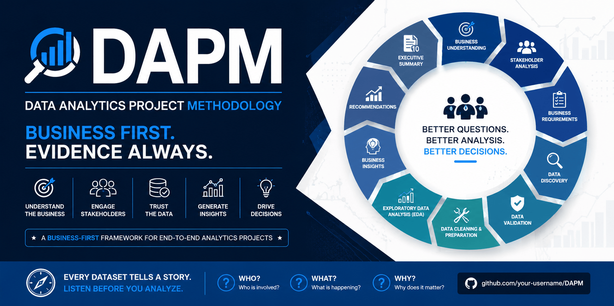

# DAPM Framework

## Data Analytics Project Methodology

*Business First. Evidence Always.*

<p align="center">
  
</p>

| Property | Value |
|----------|-------|
| **Current Version** | v0.2.1 |
| **Release Status** | Experimental |
| **Framework Type** | Business-First Data Analytics Methodology |
| **License** | CC BY-NC-SA 4.0 |

---

# Overview

The **Data Analytics Project Methodology (DAPM)** is an open-source framework that provides a structured, repeatable, and business-first approach to executing end-to-end data analytics projects.

Instead of beginning with datasets, dashboards, or programming languages, DAPM begins with the business problem.

The methodology guides analysts from understanding the business through data preparation, analysis, insights, and evidence-based recommendations.

DAPM is technology-independent and can be applied using spreadsheets, SQL, Python, R, Power BI, Tableau, or any analytical platform.

---

# Why DAPM?

Many analytics projects begin with data.

DAPM begins with the business.

This simple shift helps ensure that every analysis answers a business question and every recommendation is supported by evidence.

The framework promotes disciplined analytical thinking rather than tool-specific workflows.

---

# Supported Project Types

DAPM is designed to support different types of analytics projects.

| Project Type | Supported |
|--------------|:---------:|
| Client Consulting Projects | ✅ |
| Internal Business Projects | ✅ |
| Portfolio Projects | ✅ |
| Academic Case Studies | ✅ |
| Kaggle Projects | ✅ |
| Self-learning Projects | ✅ |

---

# DAPM Workflow

The complete methodology architecture is maintained separately.

➡️ **[DAPM Architecture](docs/ARCHITECTURE.md)**

This document defines:

- Official workflow
- Phase responsibilities
- Design principles
- Architecture decisions

---

# Documentation

The framework documentation is organized into focused documents.

| Document | Description |
|----------|-------------|
| **[ARCHITECTURE](docs/ARCHITECTURE.md)** | Official DAPM workflow and phase responsibilities. |
| **[PHILOSOPHY](docs/philosophy.md)** | The ideas and mindset behind the methodology. |
| **[PRINCIPLES](docs/principles.md)** | Core principles followed by every DAPM project. |
| **[TERMINOLOGY](docs/terminology.md)** | Standard terminology used throughout the framework. |
| **[ROADMAP](docs/roadmap.md)** | Planned improvements and future releases. |
| **[VERSIONING](docs/versioning.md)** | Versioning strategy for DAPM releases. |

---

# Template Library

DAPM includes a standardized documentation library for analytics projects.

Templates are currently under validation through practical implementations.

| Template | Purpose |
|----------|---------|
| Project Brief | Defines the business problem and project scope. |
| Project Summary | Summarizes the completed engagement. |
| Business Understanding | Documents business operations and context. |
| Stakeholder Analysis | Identifies stakeholders and their information needs. |
| Business Requirements | Defines business questions, KPIs, and reporting needs. |
| Data Discovery | Documents available datasets and data sources. |
| Data Profiling | Records the characteristics of the raw dataset. |
| Validation Report | Documents business validation results. |
| EDA Report | Records exploratory analysis and observations. |
| Business Insights | Converts findings into business understanding. |
| Recommendations | Provides evidence-based business actions. |
| Executive Summary | Presents findings for decision makers. |

➡️ **See the complete template library in [`templates/`](templates/).**

---

# Validation Projects

DAPM follows an evidence-driven development approach.

Every architectural decision, document, and template is validated through practical analytics projects before becoming part of a stable release.

Current validation projects include:

- **WAVE** Warehouse Operations & Inventory Analytics
- **LOGIX** Distribution Center & Logistics Analytics  

Future validation projects will expand into additional business domains.

---

# Repository Structure

```text
DAPM
│
├── docs/
├── templates/
├── checklists/
├── examples/
├── improvements/
├── assets/
│
├── README.md
├── CHANGELOG.md
├── CONTRIBUTING.md
├── LICENSE
└── VERSION.md
```

---

# Getting Started

1. Read the **Architecture** document.
2. Understand the **Philosophy** and **Principles**.
3. Review the project templates.
4. Follow the DAPM workflow throughout your analytics project.
5. Validate findings before making business recommendations.

---

# Version Status

DAPM is currently under active development.

The methodology evolves through practical implementation rather than theoretical assumptions.

Every significant change is validated before being included in a stable release.

---

# Roadmap

Future releases will focus on:

- Additional validation projects
- Improved documentation
- Domain-specific blueprints
- Community contributions
- Methodology refinement based on practical evidence

See **[Roadmap](docs/ROADMAP.md)** for details.

---

# Contributing

DAPM is an open and evolving methodology.

Suggestions, discussions, validation findings, and improvements are welcome.

Please open an Issue or submit a Pull Request if you would like to contribute.

---

# License

DAPM Framework © 2026 Subir Sutradhar

Licensed under **CC BY-NC-SA 4.0**.

See the [**LICENSE**](LICENSE) file for complete licensing information.

---

> **Business First. Evidence Always.**